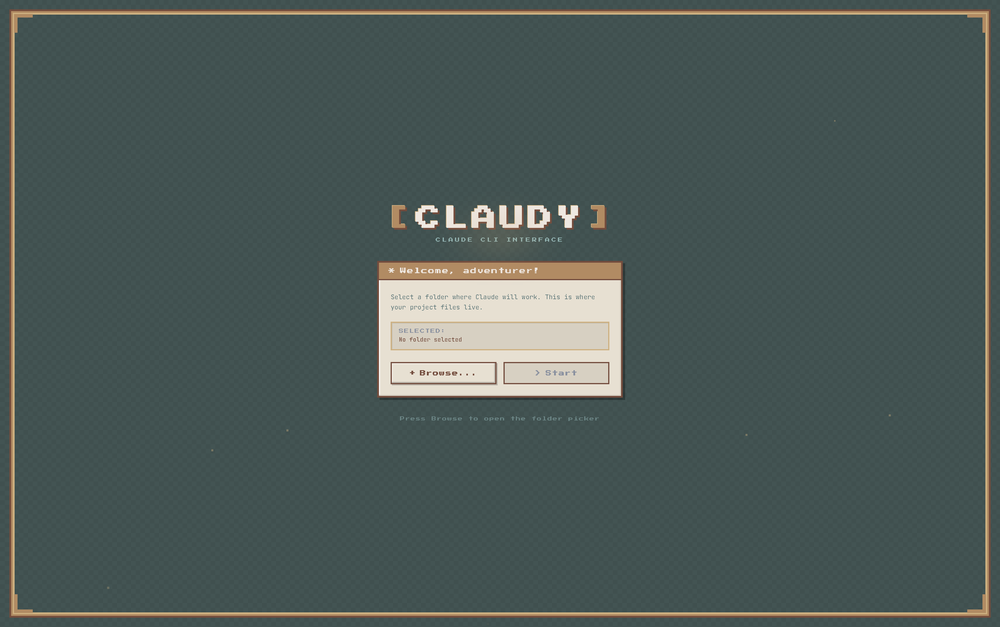
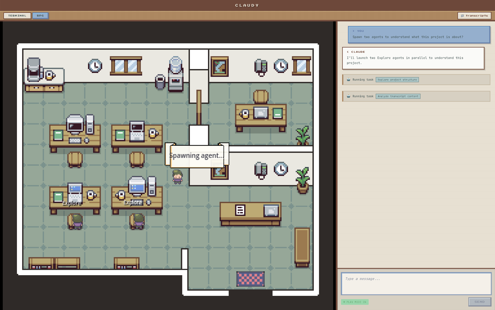
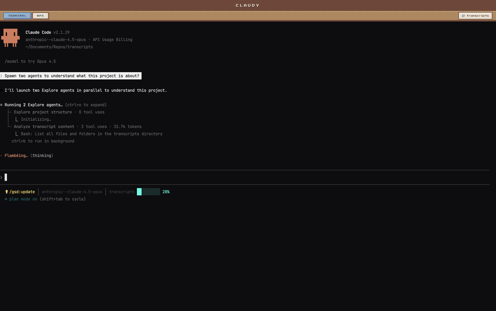

# Claudy

**Your AI coding assistant, visualized as a cozy pixel-art office adventure.**

Claudy transforms the Claude CLI experience into something you can actually *watch*. Instead of staring at scrolling text in a terminal, you get a charming little character who runs around a virtual office doing your bidding—fetching files from cabinets, typing at terminals, and celebrating when tasks are complete.

---

## What Is This?

Claudy is a desktop app that wraps [Claude Code](https://claude.ai/code) (Anthropic's AI coding assistant) in a fun, visual interface. It has two views:

1. **Terminal View** — The classic command-line experience, if you prefer it
2. **RPG View** — A split screen with a pixel-art game on the left and a chat panel on the right

When you ask Claude to do something, the little character in the game physically walks to different parts of the office based on what Claude is doing:

| Claude is... | Character goes to... |
|--------------|---------------------|
| Reading files | The filing cabinet |
| Editing code | The main desk |
| Running commands | The computer terminal |
| Searching the web | The bookshelf |
| Spawning helper tasks | The center of the room |

It's like having a tiny robot assistant you can watch work.

---

## Screenshots

### Welcome Screen

*Select a project folder to get started*

### RPG View

*Watch your character navigate the office while Claude works — here spawning helper agents*

### Terminal View

*Full terminal experience with Claude Code running multiple parallel agents*

---

## Getting Started

### Prerequisites

Before you begin, make sure you have:

1. **Node.js** (version 18 or higher) — [Download here](https://nodejs.org/)
2. **Claude CLI** installed and authenticated — [Get Claude Code](https://claude.ai/code)

### Installation

```bash
# Clone the repository
git clone <repo-url>
cd emulator

# Install dependencies (this also rebuilds native modules for Electron)
npm install
```

### Running the App

**Development mode** (with hot reload):
```bash
# In one terminal, start the dev servers
npm run dev

# In another terminal, run Electron
electron . --dev
```

**Production mode**:
```bash
npm start
```

---

## How It Works

### The Big Picture

```
┌─────────────────────────────────────────────────────────────────┐
│                         CLAUDY APP                              │
│                                                                 │
│  ┌──────────────┐                    ┌──────────────────────┐  │
│  │   Terminal   │◄──── same ────────►│      RPG View        │  │
│  │    View      │      PTY           │  ┌────────┐ ┌──────┐ │  │
│  │  (xterm.js)  │      session       │  │ Game   │ │ Chat │ │  │
│  └──────────────┘                    │  │(Godot) │ │Panel │ │  │
│         │                            │  └────────┘ └──────┘ │  │
│         │                            └──────────────────────┘  │
│         ▼                                      │               │
│  ┌─────────────────────────────────────────────┘               │
│  │                                                             │
│  │              Claude CLI (running in PTY)                    │
│  │                         │                                   │
│  │                         ▼                                   │
│  │              Transcript Files (.jsonl)                      │
│  │                         │                                   │
│  │                         ▼                                   │
│  │              Transcript Watcher                             │
│  │              (detects what Claude is doing)                 │
│  │                         │                                   │
│  │            ┌────────────┼────────────┐                      │
│  │            ▼            ▼            ▼                      │
│  │     Chat Messages   Tool Events   Game Events              │
│  │     (to Chat Panel) (status)     (character moves)         │
│  └─────────────────────────────────────────────────────────────┘
└─────────────────────────────────────────────────────────────────┘
```

### In Plain English

1. **You type a message** in either the Terminal or the Chat Panel
2. **Claude receives it** through a pseudo-terminal (PTY) — basically a fake terminal that the app controls
3. **Claude thinks and works**, writing a log of everything it does to transcript files
4. **The app watches those files** and figures out what Claude is doing
5. **Based on Claude's actions**, the game character moves around the office
6. **You see everything** — the conversation in the chat panel, and the visualization in the game

---

## The Office Metaphor

The pixel-art office isn't just cute decoration—each location represents a type of work Claude does:

| Location | What It Represents | When Character Goes There |
|----------|-------------------|--------------------------|
| **Filing Cabinet** | File storage and retrieval | Reading, searching, or globbing files |
| **Main Desk** | Code editing | Editing or writing files |
| **Computer Terminal** | Command execution | Running bash commands |
| **Bookshelf** | Research and references | Web searches or fetching URLs |
| **Center Room** | Coordination | Spawning helper agents or asking questions |
| **Door** | Entry/exit | When helper agents spawn or leave |

### Character States

The character also shows different emotions:

- **Thinking** — Pacing or standing still with thought bubbles
- **Focused** — Working intently with a status bubble showing the current task
- **Happy** — Little celebration jump when a task completes
- **Confused** — Question marks when something unexpected happens

---

## Project Structure

```
emulator/
├── src/
│   ├── main/                    # Electron main process (Node.js)
│   │   ├── main.ts             # App entry point, creates window
│   │   ├── pty/PtyManager.ts   # PTY session management
│   │   ├── claude-code/
│   │   │   ├── process-manager.ts    # Spawns and manages Claude CLI
│   │   │   └── transcript-watcher.ts # Watches Claude's log files
│   │   └── ipc/handlers.ts     # Communication between processes
│   │
│   ├── preload/
│   │   └── preload.ts          # Security bridge for IPC
│   │
│   ├── renderer/               # React UI (what you see)
│   │   ├── App.tsx            # Main app with tab switching
│   │   ├── main.tsx           # React entry point
│   │   ├── components/
│   │   │   ├── Terminal/      # xterm.js terminal emulator
│   │   │   ├── RPG/           # Game + Chat container
│   │   │   ├── GodotGame/     # Embedded Godot game
│   │   │   ├── ChatPanel/     # Chat messages and input
│   │   │   ├── SplashScreen/  # Loading screen
│   │   │   └── FolderSelector/# Project folder picker
│   │   ├── hooks/
│   │   │   └── useTranscript.ts # Subscribe to transcript events
│   │   ├── terminal/          # Terminal configuration
│   │   └── styles/            # CSS (pixel-art theme)
│   │
│   └── shared/
│       ├── ipc-channels.ts    # Communication channel names
│       └── types.ts           # TypeScript type definitions
│
├── public/
│   └── godot/                 # Compiled Godot game files
│       ├── index.html
│       ├── index.js
│       ├── index.wasm
│       └── index.pck
│
├── godot-src/                 # Godot game source code
│   ├── project.godot          # Godot project file
│   ├── Main.tscn              # Main scene
│   ├── Player.gd              # Character controller
│   ├── Player.tscn            # Player scene
│   ├── EventHandler.gd        # Handles events from Electron
│   ├── AgentManager.gd        # Manages helper agent visuals
│   ├── UIOverlay.gd           # Status bubbles and UI
│   └── Door.gd                # Door interactions
│
└── package.json
```

---

## Tech Stack

| Technology | What It Does |
|------------|--------------|
| **Electron** | Makes it a desktop app (combines Node.js + Chromium) |
| **React** | Builds the user interface |
| **TypeScript** | Adds type safety to JavaScript |
| **Vite** | Fast build tool and dev server |
| **xterm.js** | Terminal emulator in the browser |
| **node-pty** | Creates real terminal sessions |
| **Godot 4.6** | Game engine for the pixel-art office |
| **chokidar** | Watches files for changes |

---

## Development

### NPM Scripts

| Command | What It Does |
|---------|--------------|
| `npm install` | Install dependencies and rebuild native modules |
| `npm run dev` | Start development mode with hot reload |
| `npm run build` | Build for production |
| `npm start` | Build and run the app |
| `npm run rebuild` | Rebuild native modules (if you have issues) |
| `npm run dist` | Package the app for distribution |

### Modifying the Game

The Godot game source is in `godot-src/`. To make changes:

1. Open `godot-src/project.godot` in Godot 4.6
2. Make your changes
3. Export: Project → Export → Web preset
4. The files export to `public/godot/`
5. Rebuild the Electron app: `npm run build`

---

## Visual Design

Claudy uses a **16-bit pixel-art aesthetic** inspired by classic RPG games. The color palette features:

- **Warm browns** for borders and accents (like wooden frames)
- **Sage greens** and **teals** for backgrounds
- **Cream whites** for content areas
- **The "Press Start 2P" font** for that authentic retro feel

The goal is to make coding feel like a cozy adventure game.

---

## Troubleshooting

### "node-pty" build errors
```bash
npm run rebuild
```

### Native module issues
```bash
rm -rf node_modules
npm install
```

### Game not loading
Make sure the Godot export files exist in `public/godot/`. If not, export from Godot.

### Claude CLI not found
Make sure Claude CLI is installed and in your PATH. Try running `claude` in a regular terminal first.

---

## Why "Claudy"?

It's Claude + Buddy. A friendly little companion that makes coding with AI feel more personal and fun.

---

## License

MIT License — see [LICENSE](LICENSE) for details.

---

## Credits

- **Claude** by Anthropic — The AI that powers everything
- **Godot Engine** — The open-source game engine

### Asset Credits

| Asset | Creator | License |
|-------|---------|---------|
| **Office Tileset** | [Donarg](https://donarg.itch.io/) | Custom license (credit appreciated) |
| **UI Elements** | [Crusenho](https://crusenho.itch.io) | CC BY 4.0 |
| **Adam Character Sprites** | [Penzilla](https://penzilla.itch.io/) | Penzilla Standard License |

Thank you to these talented artists for making their work available!
